# Oxidizing Lambda Functions

This project is used to showcase benefits of using the Rust programming language in AWS lambda functions with purely Rust written lambdas, but also other approaches that besides not been written in Rust, could still benefit from it for lambda functions written in other languages and using other runtimes.

For the benchmarks, I've used the [AWS Lambda Power Tuning](https://docs.aws.amazon.com/lambda/latest/operatorguide/profile-functions.html) tool, which allows to automate the process of measuring the execution time on different memory allocation setups for each lambda function, and also provides a UI online tool [AWS Lambda Power Tuning UI](https://github.com/matteo-ronchetti/aws-lambda-power-tuning-ui) to generate visualizations for results obtained, and even compare a pair of lambda functions results between each other.

## Architecture

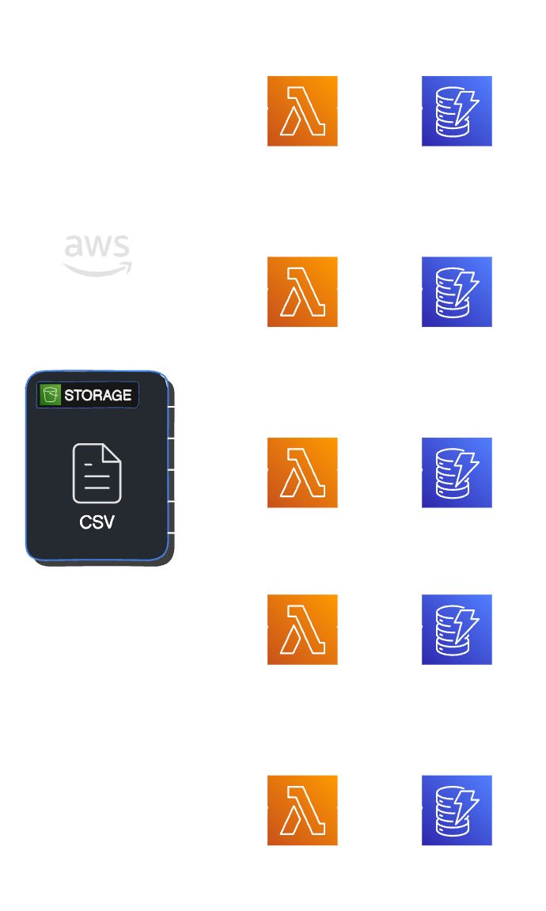

# How to Deploy

Instructions for deployment of this stack can be found at [docs/HOW_TO_DEPLOY.md](docs/HOW_TO_DEPLOY.md)

## Lambda Strategies

Lambda supports multiple languages through the use of runtimes. A runtime provides a language-specific environment that relays invocation events, context information, and responses between Lambda and the function.

For a list of supported runtimes see: [AWS Lambda Runtimes](https://docs.aws.amazon.com/lambda/latest/dg/lambda-runtimes.html)

For Rust, the lambdas are built using the [Cargo Lambda](https://www.cargo-lambda.info) tool.

### Python with Pandas

[Pandas](https://pandas.pydata.org) is a fast, powerful, flexible and easy to use open source data analysis and manipulation tool, built on top of the Python programming language.

It's written in Python, and we will be using to process the csv file and calculate the averages.

### Python with Polars

[Polars](https://pola.rs) is an open-source library for data manipulation, known for being one of the fastest data processing solutions on a single machine. It features a well-structured, typed API that is both expressive and easy to use.

It's from our interest here because it's written in Rust, but can be used in Node and Python as any other dependency. Taking approach of Rust interoperability.

### Nodejs

[Nodejs](https://nodejs.org) is a free, open-source, cross-platform JavaScript runtime environment that lets developers create servers, web apps, command line tools and scripts.

Current Nodejs latest runtime supported by AWS is `nodejs20.x`.

### LLRT (Low Latency Runtime)

[LLRT](https://github.com/awslabs/llrt) is a lightweight JavaScript runtime designed developed by AWS prior to address the growing demand for fast and efficient Serverless applications.

It's built in Rust, utilizing [QuickJS](https://github.com/quickjs-ng/quickjs) as JavaScript engine, ensuring efficient memory usage and swift startup.

### Rust

[Rust](https://www.rust-lang.org) is a systems programming language focused on safety, speed, and concurrency, with no runtime or garbage collector.

## Experiments

At the moment there's only one experiment tried, which involves parsing a CSV file.
The idea would be to add more experiments in the future of use cases that are closer to real ones in the industry, therefore, the results obtained have more value for different teams and not doing assumptions based on calcuating fibonnacy series, or other types of tasks that no one really does in real usages of lambda functions.

### Experiment 1: CSV Parsing file

This experiment involves parsing a csv file that has records of a medical insurance company that stores the recovery time in days per diagnosis, per hospital, and the treatment given to the patient on each case.

The file content looks like the following:

| Hospital | Diagnosis | Treatment | Recovery Time |
| ---- | ---- | --- | ---- |
| Hospital 1 | Diagnosis 1 | Treatment 1 | 12 |
| Hospital 1 | Diagnosis 1 | Treatment 1 | 14 |
| Hospital 2 | Diagnosis 1 | Treatment 2 | 15 |
| Hospital 1 | Diagnosis 2 | Treatment 3 | 10 |
| Hospital 2 | Diagnosis 2 | Treatment 4 | 8 |
| ... | ... | ... | ... |

The goal of the lambda functions here is to perform an ETL process over logs that are stored in csv files in a S3 bucket in order to store the average recovery time per diagnosis by hospitals in a DynamoDB table that is used later by employees of the company to decide which hospitals to recommend to their clients in order to have a faster recovery and a lower bill to pay, which also means lower costs for the company itself.

This involves different types of tasks:
1. I/O: Reading files from S3
2. CPU: Parsing data
3. CPU: Doing calculations of averages and other values
4. I/O: Storing results in DynamoDB

We're running the experiment with two different length of files, one with ten thousand records, considered small, and another one with one million records, considered big. This is based on a real use case where a medical insurance company was generating between one and two thousand records per day.

I'm storing the data in the following manner in the DynamoDB table in order to have values per experiment run, however, in the real use case, as the comppany only needs to run it once per file, it is stored slightly different.

The data in the experiment is stored in DynamoDB per each run as follows:

| Column Name | Column Type | Description |
| --- | --- | --- |
| PK | Partition Key (String) | Filled with the AWS Request ID received in the lambda contenxt |
| SK | Sort Key (String) | It's conformed as `#diagnosis#{Name of Diagnosis}#hospital#{Name of Hospital}` |
| AverageRecoveryTime | Data (Number)  | The average of all recovery times for a given diagnosis in a hospital |
| Diagnosis | Data (String) | Name of Diagnosis |
| Hospital | Data (String) | Name of Hospital |
| MostUsedTreatment | Data(String) | The most frequent treatment for a given diagnosis in a hospital |

Check this for the talk on how to explain how lambda cold starts work:
https://www.apexon.com/blog/optimizing-aws-lambda-handling-cold-starts-for-serverless-heavy-applications/

## Results

## Cold Starts

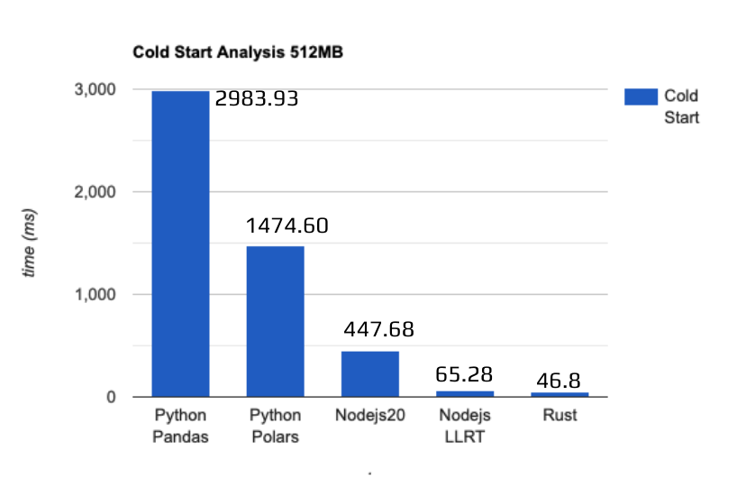

The finding is that including Rust defintively improves the cold start of the lambda functions in all cases where it's used.

### Python with Pandas:

#### One Million Rows

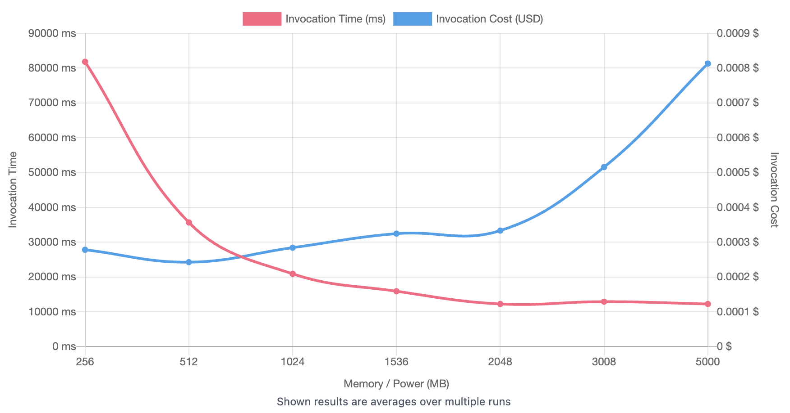

[Link](https://lambda-power-tuning.show/#AAEAAgAEAAYACMALiBM=;FdGfR1VQC0cARKNGAIx4RqtkP0arpklGVUk/Rg==;9dyROYFNfjllApU5ByKqOVmxrjn5KAc6SyBVOg==)

#### Ten Thousand Rows

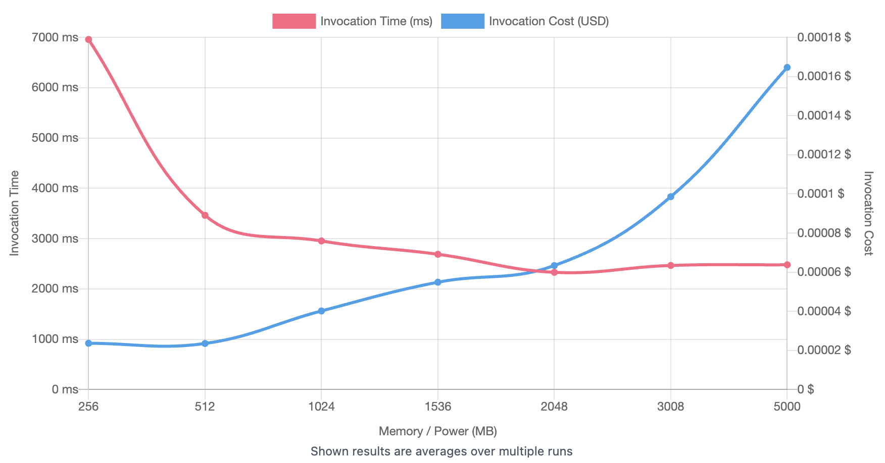

[Link](https://lambda-power-tuning.show/#AAEAAgAEAAYACMALiBM=;q27ZRatqWEWrmjhFqwooRVWdEUWrIhpFAPAaRQ==;c3PGN86JxTfvgCg4wRRmOLvohDgzsM44I54sOQ==)

### Python with Polars:

#### One Million Rows

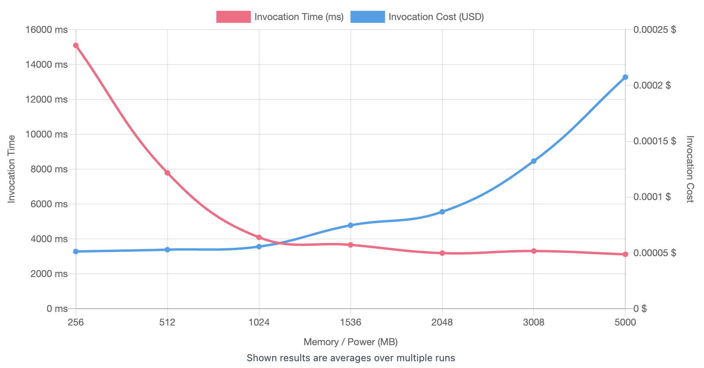

[Link](https://lambda-power-tuning.show/#AAEAAgAEAAYACMALiBM=;VfFrRgCE80VVBYBFqyplRVWVR0WrCk9Fq0JDRQ==;jllXOChEXjgJtGk4mOGcOKAxtjiayAo5mplZOQ==)

#### Ten Thousand Rows

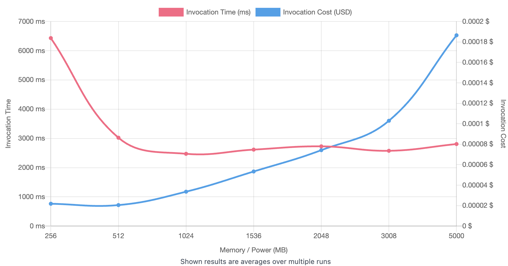

[Link](https://lambda-power-tuning.show/#AAEAAgAEAAYACMALiBM=;VfXIRavyPEWrmhpFAIgjRauKKkVVBSFFAHgvRQ==;l2u3NyN/rDeMHw04pOtfOEmrmzh659c404ZDOQ==)

### Comparisons

- [One Million](https://lambda-power-tuning.show/#AAEAAgAEAAYACMALiBM=;FdGfR1VQC0cARKNGAIx4RqtkP0arpklGVUk/Rg==;9dyROYFNfjllApU5ByKqOVmxrjn5KAc6SyBVOg==;AAEAAgAEAAYACMALiBM=;VfFrRgCE80VVBYBFqyplRVWVR0WrCk9Fq0JDRQ==;jllXOChEXjgJtGk4mOGcOKAxtjiayAo5mplZOQ==;Python%201M%20Pandas;Python%201M%20Polars)

- [Ten Thousand](https://lambda-power-tuning.show/#AAEAAgAEAAYACMALiBM=;q27ZRatqWEWrmjhFqwooRVWdEUWrIhpFAPAaRQ==;c3PGN86JxTfvgCg4wRRmOLvohDgzsM44I54sOQ==;AAEAAgAEAAYACMALiBM=;VfXIRavyPEWrmhpFAIgjRauKKkVVBSFFAHgvRQ==;l2u3NyN/rDeMHw04pOtfOEmrmzh659c404ZDOQ==;Python%2010k%20Pandas;Python%2010k%20Polars)

### Nodejs:

#### One Million Rows

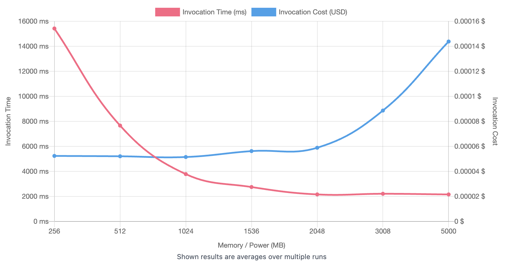

[Link](https://lambda-power-tuning.show/#AAEAAgAEAAYACMALiBM=;Vf9wRgCc70VV7WxFq2IsRatyB0VVvQpFAGAHRQ==;vfRbOHqzWjiNP1g4DhJsOCBWdziL/rk4qtIWOQ==)

#### Ten Thousand Rows

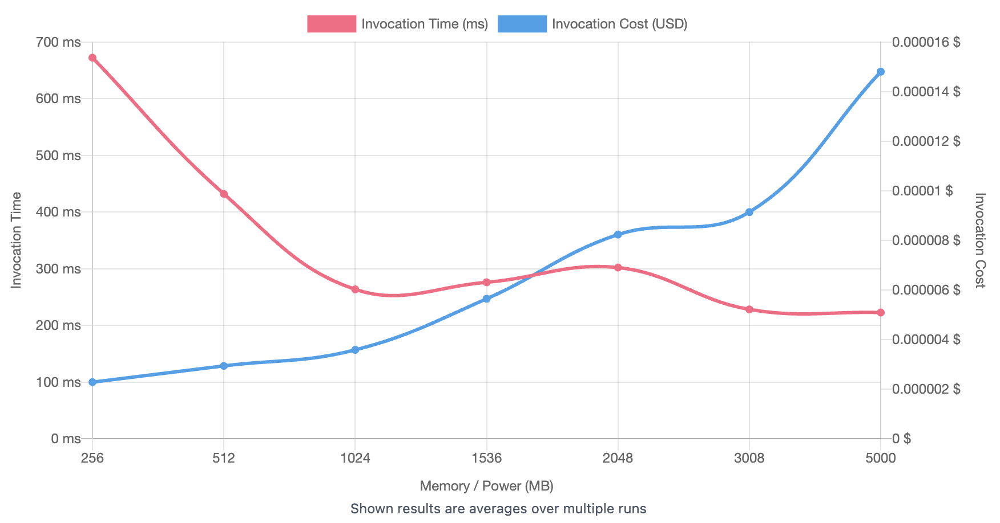

[Link](https://lambda-power-tuning.show/#AAEAAgAEAAYACMALiBM=;qyooRKsq2EOr6oNDqyqKQ6sql0MAgGRDAABfQw==;+o4ZNmiYRTaa8nA2AZy9NmdFCje5fBk3bXJ4Nw==)

### Node LLRT:

For the readers, it could be surprising than despite having a lower cold start, LLRT lambdas perform worse than native Nodejs ones, but it's kinda expected due to two limitations I faced while trying to read the csv file from S3 as a stream of data as I do in the Nodejs ones.

One: I couldn't write a real stream solution to read the file form S3, since LLRT, on it's current experimental state, doesn't support yet returning streams from SDK responses.

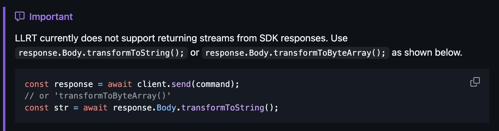

You can see this explanation at the end of the section [Using AWS SDK (v3) with LLRT](https://github.com/awslabs/llrt?tab=readme-ov-file#using-aws-sdk-v3-with-llrt) in its documentation.

So I ended using Ranged requests to read specific byte range of the file, but that loses the benefits from a real streamed response.

And two: LLRT doesn't have Just In Time compilation (JIT), which would might benefit in this case because the operations performed on the data is very repetitive and most probably could be optimized during execution with JIT.

Therefore, for this specific use case, LLRT seems not to be the best option, but, I invite the readers to do their own tests, because there are other benchmarks out there where other persons have gotten different results for their use cases. See the [Other Benchmarks](#other-benchmarks) section below.

#### One Million Rows

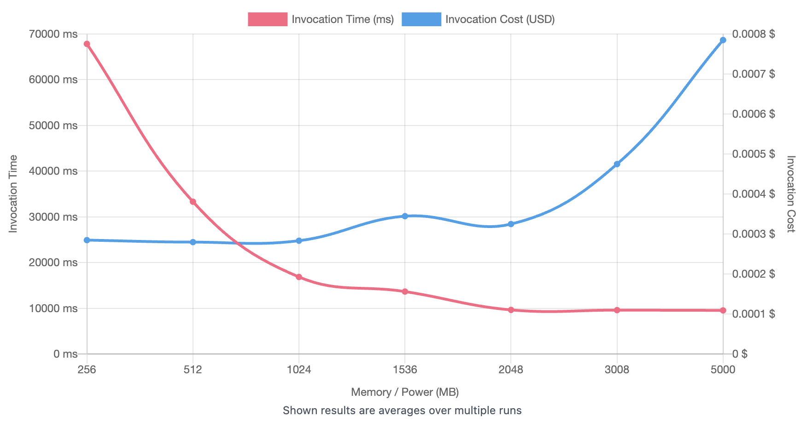

[Link](https://lambda-power-tuning.show/#AAEAAgAEAAYACMALiBM=;wIGER1U0AkdV0oNGVdFVRlUpF0ZVYRZGVX0VRg==;pWSVOZfMkjl5oJQ5mM60OYBvqjmVCPk5EsBNOg==)

#### Ten Thousand Rows

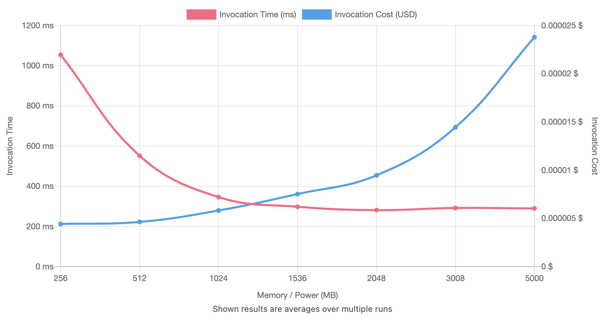

[Link](https://lambda-power-tuning.show/#AAEAAgAEAAYACMALiBM=;ANCDRFUVCkQAQK1DAECVQ6vqjENVFZJDAACRQw==;AK6UNvfdmzbim8M2cNP8Nq33HjdLl3I3n47HNw==)

### Comparisons

- [One Million](https://lambda-power-tuning.show/#AAEAAgAEAAYACMALiBM=;wIGER1U0AkdV0oNGVdFVRlUpF0ZVYRZGVX0VRg==;pWSVOZfMkjl5oJQ5mM60OYBvqjmVCPk5EsBNOg==;AAEAAgAEAAYACMALiBM=;Vf9wRgCc70VV7WxFq2IsRatyB0VVvQpFAGAHRQ==;vfRbOHqzWjiNP1g4DhJsOCBWdziL/rk4qtIWOQ==;LLRT%201M;Nodejs20%201M)

- [Ten Thousand](https://lambda-power-tuning.show/#AAEAAgAEAAYACMALiBM=;ANCDRFUVCkQAQK1DAECVQ6vqjENVFZJDAACRQw==;AK6UNvfdmzbim8M2cNP8Nq33HjdLl3I3n47HNw==;AAEAAgAEAAYACMALiBM=;qyooRKsq2EOr6oNDqyqKQ6sql0MAgGRDAABfQw==;+o4ZNmiYRTaa8nA2AZy9NmdFCje5fBk3bXJ4Nw==;LLRT%2010k;Nodejs20%2010k)

### Rust

Despite I didn't optimize too much the Rust lambda functions as I did, or at least tried for the other ones, it got amazing results in comparison with those. I rewrote the Python and Js lambda functions at least three times each, trying to improve them, while the Rust one I found it good enough at the first attempt.

#### One Million Rows

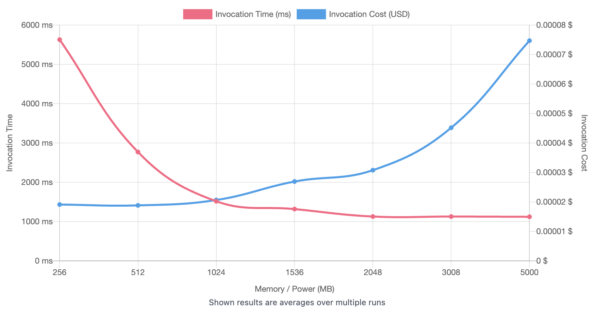

[Link](https://lambda-power-tuning.show/#AAEAAgAEAAYACMALiBM=;VemvRatCLUVV5b1EVQWlRFVljUSrSo1EVYWMRA==;IpOgN9AtnjfIaK03QA/iN/EkAThcgz04CKycOA==)

#### Ten Thousand Rows

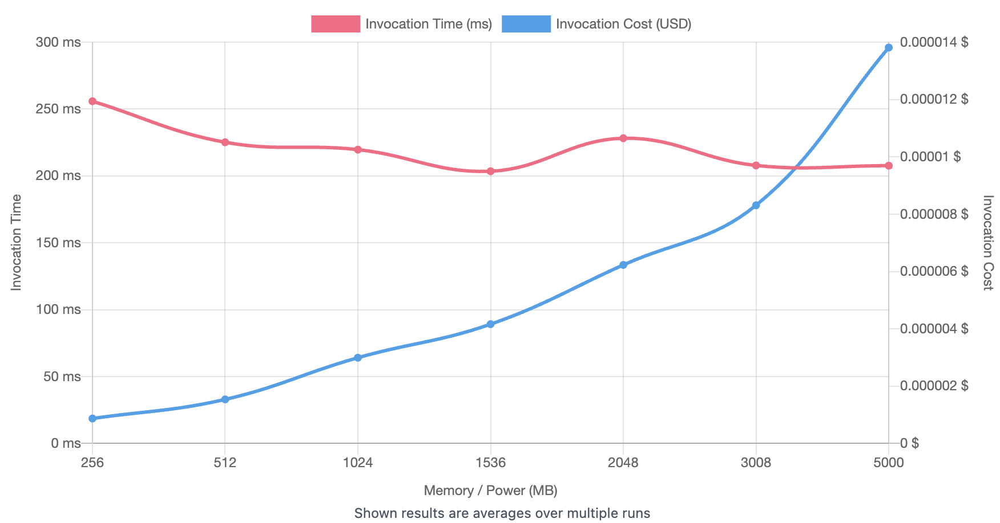

[Link](https://lambda-power-tuning.show/#AAEAAgAEAAYACMALiBM=;VdV/Q6sqYUOrqltDAIBLQ6sqZENV1U9Dq6pPQw==;b6VpNQxEzjUrykg236OLNvwA0TZ2aQs3PLxnNw==)

### Comparisons

Here, I'm comparing Rust against the best of each other runtime.

- [Rust vs Python with Polars for One Million](https://lambda-power-tuning.show/#AAEAAgAEAAYACMALiBM=;VfFrRgCE80VVBYBFqyplRVWVR0WrCk9Fq0JDRQ==;jllXOChEXjgJtGk4mOGcOKAxtjiayAo5mplZOQ==;AAEAAgAEAAYACMALiBM=;VemvRatCLUVV5b1EVQWlRFVljUSrSo1EVYWMRA==;IpOgN9AtnjfIaK03QA/iN/EkAThcgz04CKycOA==;Python%20Polars%201M;Rust%201M)

- [Rust vs Nodejs for One Million](https://lambda-power-tuning.show/#AAEAAgAEAAYACMALiBM=;Vf9wRgCc70VV7WxFq2IsRatyB0VVvQpFAGAHRQ==;vfRbOHqzWjiNP1g4DhJsOCBWdziL/rk4qtIWOQ==;AAEAAgAEAAYACMALiBM=;VemvRatCLUVV5b1EVQWlRFVljUSrSo1EVYWMRA==;IpOgN9AtnjfIaK03QA/iN/EkAThcgz04CKycOA==;Nodejs20%201M;Rust%201M)

## Conclusions

The Rust programming language definitively gives amazing results in terms of memory consumption, lower execution time and cold starts in AWS Lambda functions against languages like Python and Nodejs.

When the circumstances don't allow to use pure Rust to write Lambda functions, due to lacking of Rust knowledge, because you depend on a specific dependency that is only available in a specific language, or any other reason, there are still ways to benefit from Rust by using runtimes and/or tools written with it that are integrated in other languages.

And you will not only saving money, also contributing to reduce energy consumptions from servers, which helps for sustainability. Read about in this article from AWS: [Sustainability with Rust
](https://aws.amazon.com/es/blogs/opensource/sustainability-with-rust)

## Other Benchmarks

- [AWS Lambda Javascript Low Latency Runtime(LLRT) Benchmark](https://medium.com/@o.hanhaliuk/aws-lambda-javascript-low-latency-runtime-llrt-benchmark-part-2-cd70c989e49c) by **Oleksandr Hanhaliuk**